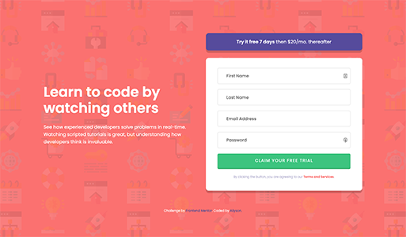

# Frontend Mentor - Intro component with sign up form solution

This is a solution to the [Intro component with sign up form challenge on Frontend Mentor](https://www.frontendmentor.io/challenges/intro-component-with-signup-form-5cf91bd49edda32581d28fd1). Frontend Mentor challenges help you improve your coding skills by building realistic projects.

## Table of contents

- [Overview](#overview)
  - [The challenge](#the-challenge)
  - [Screenshot](#screenshot)
  - [Links](#links)
- [My process](#my-process)
  - [Built with](#built-with)
  - [What I learned](#what-i-learned)
  - [Continued development](#continued-development)
  - [Useful resources](#useful-resources)
- [Author](#author)

## Overview

### The challenge

Users should be able to:

- View the optimal layout for the site depending on their device's screen size
- See hover states for all interactive elements on the page
- Receive an error message when the `form` is submitted if:
  - Any `input` field is empty. The message for this error should say _"[Field Name] cannot be empty"_
  - The email address is not formatted correctly (i.e. a correct email address should have this structure: `name@host.tld`). The message for this error should say _"Looks like this is not an email"_

### Screenshot

### Links

- Solution URL: [https://github.com/allyson-s-code/Intro-Component-with-Sign-Up-Form](https://github.com/allyson-s-code/Intro-Component-with-Sign-Up-Form)
- Live Site URL: [https://allyson-s-code.github.io/Intro-Component-with-Sign-Up-Form/](https://allyson-s-code.github.io/Intro-Component-with-Sign-Up-Form/)

## My process

### Built with

- Semantic HTML5 markup
- CSS custom properties
- Flexbox
- Mobile-first workflow

### What I learned

I enjoyed working on this user interface. I learned a lot about coding forms and displaying errors using JavaScript.

### Continued development

I will be continuing to work on my JavaScript and making it as clean and efficient as possible. I would love to update this code to make it more efficient as I get more comfortable with client-side validation.

### Useful resources

- [FreeCodeCamp- Form Validation](https://www.freecodecamp.org/news/form-validation-with-html5-and-javascript/) - This helped me to break down the basics of two approaches to client-side validation.
- [10 Commandments of Good Form Design on the Web](https://mono.company/design-practice/the-10-commandments-of-good-form-design-on-the-web/) - I came across this resource and thought it was a great list of 10 best practices with form design.

## Author

- Website - [Allyson Smith](https://allyson-s-code.github.io/Web-Dev-Portfolio/)

- Frontend Mentor - [@allyson-s-code](https://www.frontendmentor.io/profile/allyson-s-code)
